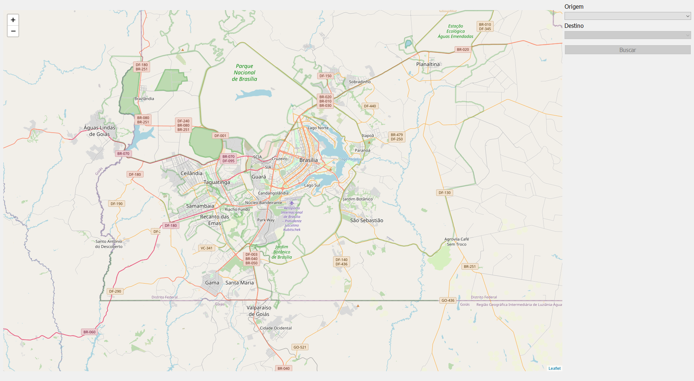

# DF-Bus

**Número da Lista**: 2<br>
**Conteúdo da Disciplina**: Grafos 2<br>

## Alunos
|Matrícula | Aluno |
| -- | -- |
| 16/0133505  |  Lucas Gomes Silva |
| 19/0134623  |  Marcos Diego da Silva Gomes |

## Sobre 
O projeto tem como objetivo utilizar o conceito de grafos no ambiente de transporte coletivo na região do Distrito Federal. Através de dados coletados, com relação ao valor das passagens de ônibus no DF, será apresentado ao usuário o caminho com o menor custo para se chegar ao destino desejado, dado o lugar de origem. O caminho é definido através da utilização do algoritmo de Dijkstra.

## Screenshots
#### Tela inicial

#### Opções

#### Resultado


## Instalação 
**Linguagem**: Python<br>
É necessário ter instalado o **Python** e o **pip** para executar o projeto (é recomendado utilizar um ambiente virtual para instalar e executar o projeto).

- Para instalar o gerenciador de pacotes pip:<br>
    ``` sudo apt-get install python3-pip ```
    
- Clone o repositório:<br>
    ``` git clone https://github.com/projeto-de-algoritmos/Grafos2_DF-Bus ```

- Instale as bibliotecas necessárias:<br>
    ``` pip install -r requirements.txt ```

## Uso 
Explique como usar seu projeto caso haja algum passo a passo após o comando de execução.

## Outros 
Quaisquer outras informações sobre seu projeto podem ser descritas abaixo.


